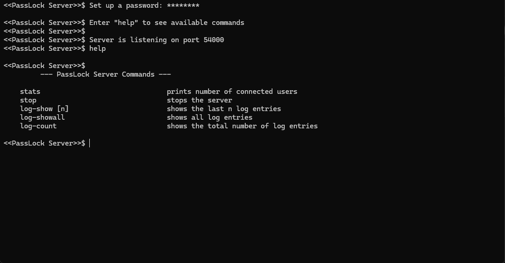
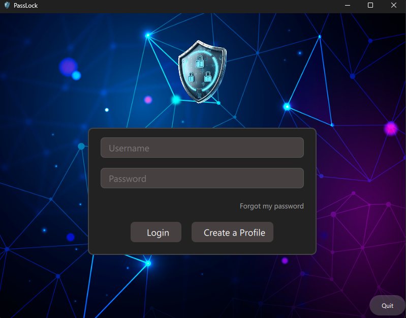
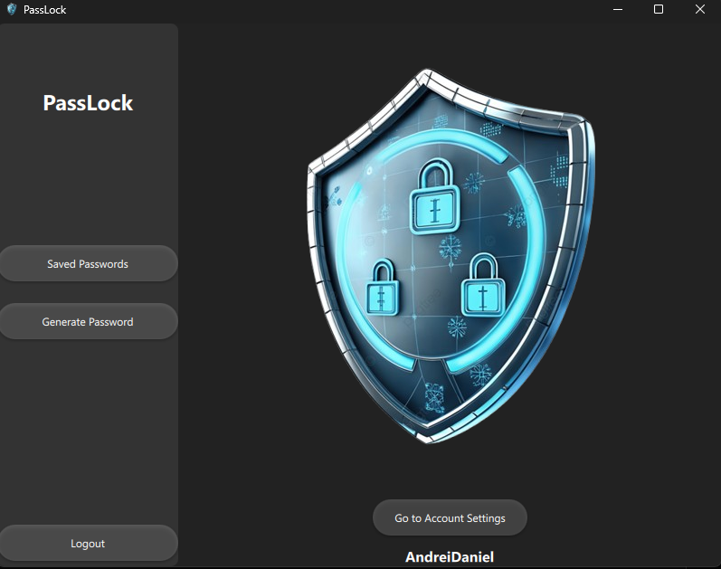
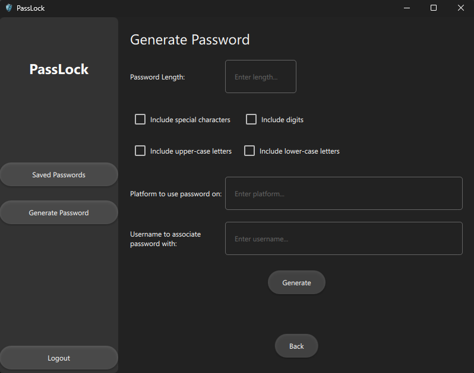
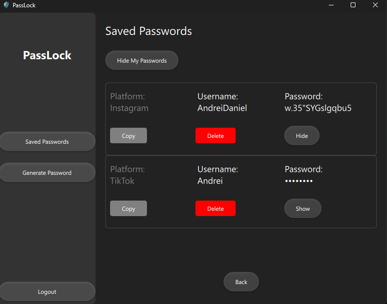

# PassLock
PassLock is a client-server application used for generating and managing passwords, built in C++ and QML. It generates, stores and manages passwords, securing them with AES encryption.
## Description
PassLock has been created as a school project for the OOP class. It was a fun challange, in which new technologies and standards have been learned. It was also the first experience of creating a functional application, with UI/UX and back-end functionalities.
## Features
- 🧩 Multiple accounts
- 🔐 Data is stored securely using Advanced Encryption Standard
- 💡 Secure & intelligent password generation
- 📁 Ability to store generated passwords for later use
- 📋 Passwords generated based on criteria specified by the user
- 🌐 Encrypted communication between the client and the server
- 🖥️ Password recovery for each account
- 📜 CLI server commands
## Screenshots
### Server Command Line Interface

### Login Page

### Dashboard

### Password Generation Page

### Stored Passwords Page
